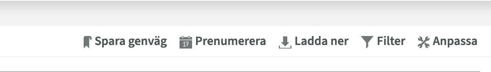

# Kulturalarm-v2

## Instruktioner för att lägga till ditt schema

1. Gå till TimeEdit och öppna ditt personliga schema
2. Klicka på knappen "Prenumerera"
   

3. I rutan som visas, klicka på "Kopiera"-knappen
   

4. Öppna Kulturalarm v2
5. Gå till "Hantera scheman"
6. Klistra in den kopierade länken i textrutan
7. Klicka på "Lägg till URL"
8. Namnge ditt schema

Klart! Nu har du lagt till ditt personliga schema i Kulturalarm v2.